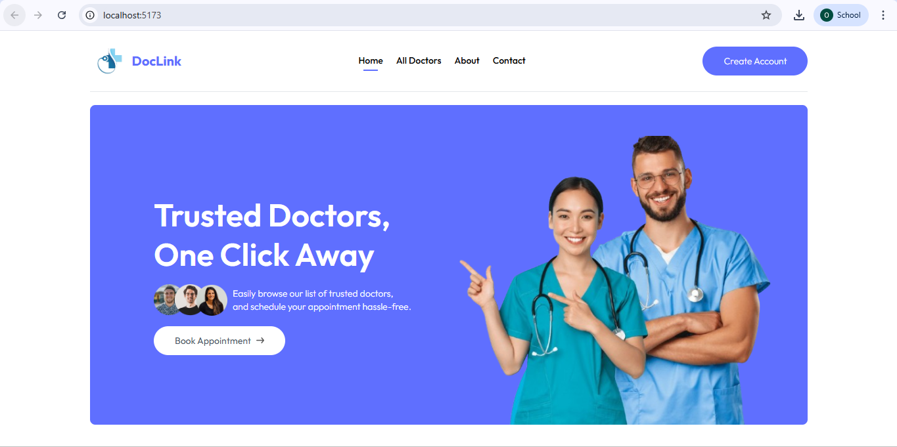
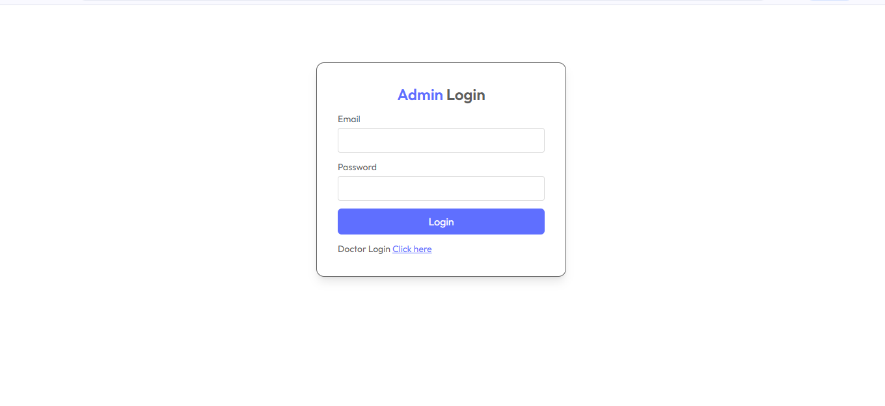
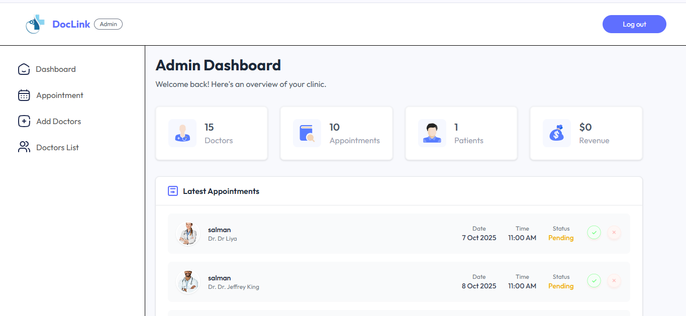

# DocLink

Doctor appointment booking system (MERN + Vite frontends). This repository contains the backend API and two frontends: an Admin dashboard and the Patient-facing frontend. The admin dashboard also now includes a Doctor panel (doctor dashboard) for doctors to manage appointments and their profile.

---

## Features

- Admin dashboard
  - Manage doctors, appointments
  - Add doctors
  - View analytics
- Doctor panel (doctor dashboard)
  - Doctor login (JWT)
  - View dashboard (earnings, patients, latest appointments)
  - View and manage appointments (complete / cancel)
  - Edit profile, fees and availability
- Patient frontend
  - Browse doctors
  - Book appointments
  - Payment integrations (if configured)

---

## Tech stack

- Backend: Node.js, Express, MongoDB (Mongoose)
- Auth: JWT, bcrypt
- Frontends: React + Vite (Admin and Patient frontends)
- File uploads: Cloudinary

---

## Repository layout

```
DocLink/
├─ backend/            # Express API
├─ admin/              # Admin + Doctor panel (React + Vite)
└─ frontend/           # Patient-facing site (React + Vite)
```

---

## Screenshots

Add screenshots to `docs/screenshots/` and then update or keep the placeholders below.
- Frontend (Home)
  

- Frontend (Booking)
  

- Admin (Login)
  

- Admin (Dashboard)
  

- Doctor (Login)
  

- Doctor (Dashboard)
  

- Doctor (Appointments)
  

- Doctor (Profile)
  


## Quick start (Windows / PowerShell)

Prerequisites
- Node.js (16+ recommended)
- npm
- MongoDB (connection string or hosted DB)

1) Clone repository

```powershell
cd D:\MernStack
git clone <your-repo-url> DocLink
cd DocLink
```

2) Backend

```powershell
cd backend
npm install
# create a .env file with required environment variables (see below)
npm run server
# or
npm start
```

3) Admin dashboard (admin panel + doctor panel)

```powershell
cd ..\admin
npm install
npm run dev
```

4) Patient frontend

```powershell
cd ..\frontend
npm install
npm run dev
```

Open the URLs printed by Vite in the browser (often http://localhost:5173 or similar). Make sure `VITE_BACKEND_URL` in front-end `.env` files points to your backend (for example `http://localhost:5000`).

---

## Environment variables

Backend `backend/.env` (example variables you should set):

```
PORT=5000
MONGO_URI=your_mongodb_connection_uri
JWT_SECRET=your_jwt_secret
CLOUDINARY_CLOUD_NAME=...
CLOUDINARY_API_KEY=...
CLOUDINARY_API_SECRET=...
# any other provider keys (payhere, razorpay, stripe) if used
```

Frontends (Admin and frontend) - create `.env` files with a Vite variable:

```
VITE_BACKEND_URL=http://localhost:5000
```

---

## API (high-level)

The backend exposes endpoints under `/api`. Example doctor-related routes implemented:

- `POST /api/doctor/login` - doctor authentication, returns JWT token
- `GET /api/doctor/appointments` - get appointments for authenticated doctor
- `POST /api/doctor/complete-appointment` - mark appointment completed
- `POST /api/doctor/cancel-appointment` - cancel appointment
- `GET /api/doctor/dashboard` - doctor dashboard statistics
- `GET /api/doctor/profile` - get doctor profile
- `POST /api/doctor/update-profile` - update profile

Admin routes (examples) are in `backend/routes/adminRoute.js` and include authentication, doctor management, and appointment management.

---

## Notes & tips

- If you see login issues for doctors or admins, confirm tokens are stored in `localStorage` as `aToken` (admin) and `dToken` (doctor).
- For production, secure the JWT secret and other credentials, enable HTTPS and proper CORS/origins.

---

## Contributing

Contributions are welcome. Open an issue or a PR describing the change.

---

## License

This project does not include a license file by default. Add one if you intend to publish it publicly.

---

